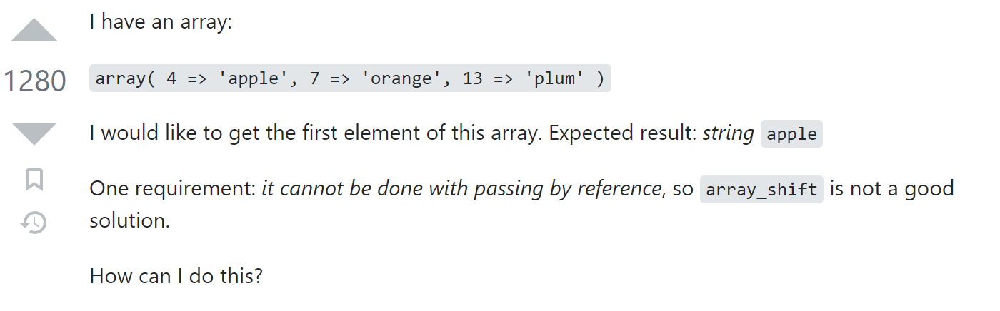

## Introduction: Smart Vs. Not So Smart, Analyzing Questions 
Once you get to a certain level in academics you'll notice that answers to your questions are worth nothing if you ask the wrong questions. Knowing how to ask questions is just as important as knowing how to properly answer a question. Especially when it comes to stack overflow, the reasoning being you are presenting a complete stranger a problem, data to that problem, and context in as a concise of a question as you can make. Your question shouldn't only present the problem but properly set the stage for how the problem was developed. Since your bug could be a function you've failed to mention, the answer to your problem cannot exist. Proper answers should include any potentially relevant detail and minimize any information outside of that. The clearer and more concise you are with the question the cleaere and more concise the answers you will recieve.

## Example 1: A not so smart question.

Here is a link to the [Stack Overflow Post](https://stackoverflow.com/questions/45120335/rename-packagename-and-import-class-different).

Here you can see that although the context seems straight forward (The user is attempting to rename a title) what he would like that title to be renamed, what is preventing him from renaming the title, and any examples of what he is showing is completely void in the post. The scarce answers left under the post were vaugue guesses as to what the user what attempting to achieve and calls for more information. A problem renaming something is almost always in any language/framework/OS a simple one-step process but if you have no idea what you are attempting to rename and to what then it doesn't how simple the solution might be because the presentation of questions provides no way to possibly answer.

## Example 2: A smart question.

Here is a link to the [Stack Overflow Post](https://stackoverflow.com/questions/1921421/get-the-first-element-of-an-array/3771228#3771228).

In this question you can see that it is extremly straightforard, so much so that glancing at this post gives you an immediate understanding of what the user wants. He also provides a simple example and clarification for the condiiton that he needs to meet in addition to the solution to the problem. You'll find in the answers various solutions all very clear and concise since the objective is clear so to is the details of how to achieve it.
