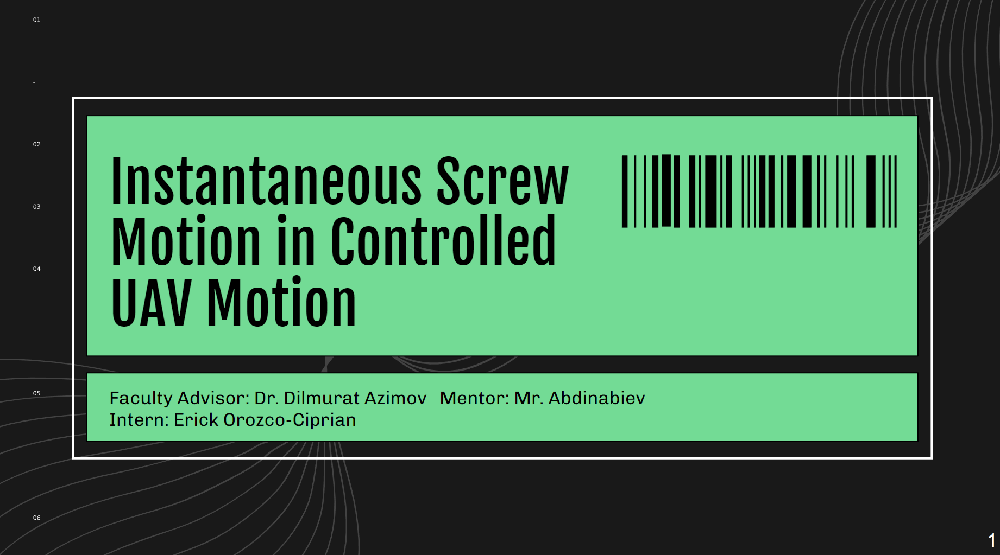

Over the summer of 2020 I worked with the Guidance, Navigation, & Control System Lab at UH Manoa to study data on the utilization of I.S.M in UAV Dynamics. In order to detemine the fficacy of ISM in UAV Motion I had to go through the following milestones

<pre>
  1. Learn the basics of matrices, differential equations, plotting functions using C++ in MATLAB (A program for processing computations)
  2. Learning Aircraft Dynamics
  3. Learning the concept of I.S.M
  4. Utilizing the previous concepts in UAV Dynamics
</pre>

<pre>

</pre>

Source: [My google slides presentation on the topic]([https://docs.google.com/presentation/d/176Xfwvp5YT2fGfkw0EdTtgRjIlGfDvMqj0VKABMR8zo/edit?usp=sharing)]
