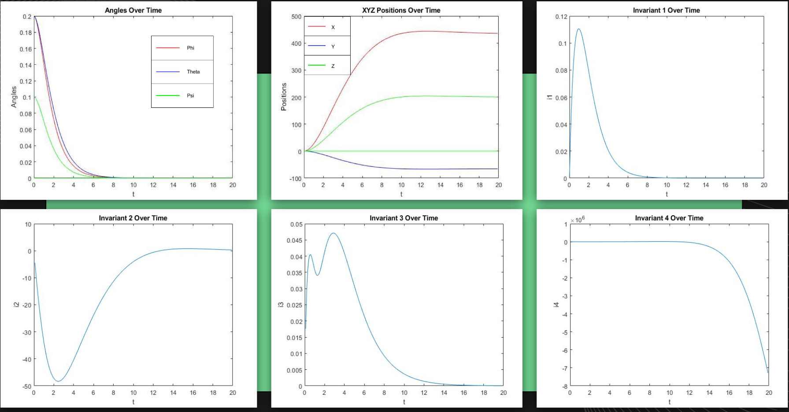

Over the summer of 2020, I worked with the Guidance, Navigation, & Control System Lab at UH Manoa to study data on the utilization of I.S.M in UAV Dynamics. Essentially UAV Dynamics are about the motion of a UAV and in a more general example the 6 degrees of freedom/motion that are associated with UAVs. This being front/back, left/right, up/down, etc. ISM (Instantaneous Scree Motion) is a concept that allows us to understand the motion of rigid bodies but this concept hasn't ever been implemented to determine the motion of UAVs. The core concept of this summer project was to go through the necessary steps to determine how efficient ISM would be for UAV Motion.

In order to detemine the efficacy of ISM in UAV Motion I had to go through the following milestones

<pre>
  1. Learn the basics of matrices, differential equations, plotting functions using C++ in MATLAB (A program for processing computations)
  2. Learning Aircraft Dynamics
  3. Learning the concept of I.S.M
  4. Utilizing the previous concepts in UAV Dynamics
</pre>

The actual physical representation of my work can be seen in this data grapgh below:

<pre>

</pre>

Essentially what this shows is the invariants (Angles of the Aircraft) and the position of the aircraft (XYZ Positions) and how they change when put through a set of equations for a maneuver I programmed. This helps show the relationship between a UAV Motion maneuver and the ISM concepts that attribute the maneuver. To learn more I've linked my actual final presentation of the topic below which shows my progress and milestones throughout the project as well as the slides themselves.

Video Presentation Source: [My video presentation on the topic]([https://docs.google.com/presentation/d/176Xfwvp5YT2fGfkw0EdTtgRjIlGfDvMqj0VKABMR8zo/edit?usp=sharing])
Slide Source: [My google slides presentation on the topic]([https://docs.google.com/presentation/d/176Xfwvp5YT2fGfkw0EdTtgRjIlGfDvMqj0VKABMR8zo/edit?usp=sharing])
